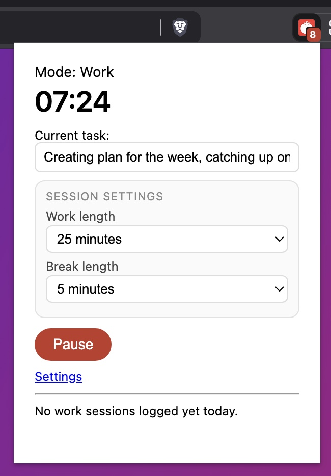

# Local Pomodoro Focus Timer

A lightweight, privacy-focused Chrome extension that helps you stay productive using the Pomodoro Technique with built-in website blocking during focus sessions.


<p align="center">
   
</p>

## Features

- **Customizable Work & Break Sessions** - Choose from preset durations (15-60 min work, 3-30 min breaks)
- **Website Blocking** - Block distracting sites during work sessions to maintain focus
- **Task Tracking** - Log what you're working on for each session
- **Daily Summary** - Track total focused minutes and view your work history
- **Visual Badge** - See remaining time on the extension icon
- **Multi-Channel Notifications** - Desktop notifications with sound alerts when sessions end
- **Privacy First** - All data stored locally, no cloud sync, no tracking
- **Customizable** - Adjust badge colors and blocked site lists

## Installation

### For Users (Easy Install)

#### Option 1: Chrome Web Store - Work in progress
*Coming soon - Extension will be published to Chrome Web Store*

#### Option 2: Manual Installation

1. **Download the Extension**
   - Click the green **Code** button above
   - Select **Download ZIP**
   - Extract the ZIP file to a folder on your computer

2. **Load into Chrome**
   - Open Chrome and navigate to `chrome://extensions/`
   - Enable **Developer mode** (toggle in top-right corner)
   - Click **Load unpacked**
   - Select the extracted `pomodoro-extension` folder
   - The extension icon should appear in your toolbar

3. **Pin the Extension** (Optional)
   - Click the puzzle piece icon in Chrome's toolbar
   - Find "Local Pomodoro Focus Timer"
   - Click the pin icon to keep it visible

### For Developers

```bash
# Clone the repository
git clone https://github.com/janotaz/pomodoro-extension.git
cd pomodoro-extension

# Load into Chrome
# 1. Navigate to chrome://extensions/
# 2. Enable "Developer mode"
# 3. Click "Load unpacked"
# 4. Select the project directory
```

## Usage

### Starting a Work Session

1. Click the extension icon to open the popup
2. Enter your current task in the "Current task" field
3. Optionally adjust work/break durations
4. Click the **Work** button to start your focus session
5. The timer will count down and block configured websites

### Taking a Break

When your work session ends, the extension will:
- Play a notification sound
- Show a desktop notification
- Automatically start your break timer

### Blocking Distracting Websites

1. Click **Settings** in the popup
2. Add websites to block (one per line):
   ```
   facebook.com
   youtube.com
   reddit.com
   ```
3. Click **Save**
4. Sites will be blocked during work sessions only

### Customizing Colors

1. Open **Settings**
2. Use the color pickers to set:
   - Work session badge color (default: red)
   - Break session badge color (default: green)
3. Click **Save**

## Configuration

### Work & Break Durations

Available presets in the popup:

**Work sessions:** 15, 25, 30, 45, 50, 60 minutes
**Break sessions:** 3, 5, 10, 15, 20, 30 minutes

### Blocked Sites Format

The extension supports multiple URL patterns:

- **Domain:** `facebook.com` (blocks facebook.com and all subdomains)
- **Subdomain:** `www.youtube.com` (blocks specific subdomain)
- **Full URL:** `https://twitter.com/` (blocks exact URL)

## Browser Compatibility

- **Chrome:** Version 88+ (Manifest V3 support)
- **Edge:** Version 88+ (Chromium-based)
- **Brave:** Version 1.20+ (Chromium-based)
- **Opera:** Version 74+ (Chromium-based)

*Note: Firefox uses a different extension system and is not currently supported.*

## Permissions Explained

This extension requires the following permissions:

- **storage** - Save your settings and work logs locally
- **alarms** - Schedule timer events
- **notifications** - Show desktop notifications when sessions end
- **webRequest** - Monitor page requests to block distracting sites
- **webRequestBlocking** - Block access to configured sites during work
- **scripting** - Play notification sounds in active tabs
- **host_permissions (`<all_urls>`)** - Required to block any site you configure

**Privacy Note:** This extension does NOT collect, transmit, or share any of your data. All information stays on your device.

## Known Limitations

- Website blocking only works during work sessions (breaks allow all sites)
- Blocking requires page refresh to take effect for already-loaded sites
- Notification sounds require an active tab to play

## Contributing

Contributions are welcome! Please see [CONTRIBUTING.md](CONTRIBUTING.md) for guidelines.

### Development Setup

1. Fork the repository
2. Create a feature branch: `git checkout -b feature/amazing-feature`
3. Make your changes
4. Test thoroughly in Chrome
5. Commit: `git commit -m 'Add amazing feature'`
6. Push: `git push origin feature/amazing-feature`
7. Open a Pull Request

## Roadmap

- [ ] Publish to Chrome Web Store
- [ ] Migrate to declarativeNetRequest API (MV3 standard)
- [ ] Add long break cycles (4 work sessions → long break)
- [ ] Export work logs (CSV/JSON)
- [ ] Productivity statistics and charts
- [ ] Keyboard shortcuts
- [ ] Custom notification sounds
- [ ] Dark mode UI

## License

This project is licensed under the MIT License - see the [LICENSE](LICENSE) file for details.

## Acknowledgments

- Built with vanilla JavaScript (no dependencies)
- Uses Chrome Extension Manifest V3
- Inspired by the Pomodoro Technique® by Francesco Cirillo

## Support

If you encounter any issues or have suggestions:
- Open an issue on [GitHub Issues](https://github.com/YOUR_USERNAME/pomodoro-extension/issues)
- Check existing issues before creating a new one

